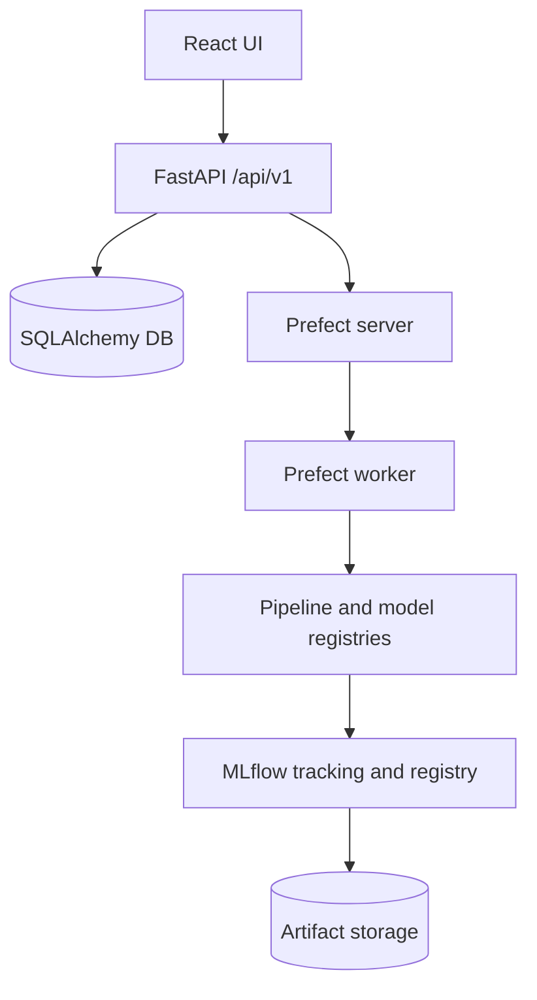
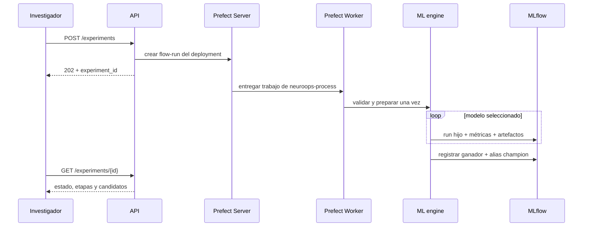

# Arquitectura de NeuroOps

## Objetivos

La arquitectura separa dominio, transporte HTTP, persistencia, ejecución de ML, observabilidad y UI. MNE/MNE-BIDS forman parte de la imagen soportada; Sovaharmony continúa aislado de la cadena histórica.

## Capas

| Capa | Ubicación | Responsabilidad |
| --- | --- | --- |
| API | `backend/app/api/v1` | HTTP, Pydantic, códigos de respuesta |
| Dominio | `backend/app/domain` | Contratos estables `PipelinePlugin` y `ModelPlugin` |
| Persistencia | `backend/app/db` | Entidades y sesiones SQLAlchemy |
| Aplicación | `backend/app/services` | datasets, experimentos, registro, predicciones |
| ML | `backend/app/ml` | plugins, validación y métricas |
| Orquestación | `backend/app/orchestration` y `backend/prefect.yaml` | tareas, flows, deployments y cola Prefect |
| Seguimiento | MLflow desde `services/experiments.py` | runs, artefactos, modelos y aliases |
| UI | `frontend/src` | flujo investigador consumiendo API real |

## Contratos de dominio

### Dataset

`Dataset` describe la identidad lógica. `DatasetVersion` conserva ruta, versión, SHA-256, tamaño y resumen. Un dataset puede ser un archivo administrado por NeuroOps o una raíz BIDS montada de solo lectura. Los experimentos referencian el dataset y registran de nuevo huella y versión en MLflow.

### Pipeline

Un plugin declara metadatos, disponibilidad, esquema de configuración y seis pasos:

1. validar entrada;
2. cargar;
3. preprocesar;
4. extraer características;
5. construir datos de entrenamiento;
6. producir artefactos adicionales.

La preparación tabular retorna el `ColumnTransformer` sin ajustarlo. El ajuste ocurre dentro de cada partición de validación, lo que evita usar estadísticas del conjunto de prueba.

### Model

Cada modelo expone únicamente parámetros permitidos y una factory. Los parámetros desconocidos, fuera de rango o con tipo incorrecto se rechazan antes de crear un experimento.

### Experiment y Run

Un `Experiment` agrupa dataset, pipeline, configuración, modelos, validación, métrica y semilla. Cada modelo crea un `TrainingRun` y un `ModelCandidate`. MLflow refleja la misma jerarquía con run padre e hijos.

## Secuencia de ejecución

## Persistencia

La base de aplicación conserva referencias necesarias para la UI, la lógica y la correlación con Prefect:

- Dataset y DatasetVersion.
- PipelineDefinition y PipelineConfiguration.
- Experiment y TrainingRun.
- ModelCandidate y RegisteredModelReference.
- PredictionJob y ArtifactReference.
- IDs de flow-runs para experimentos y predicciones.

MLflow es propietario de parámetros detallados, métricas, modelos y bytes de artefactos. La base de aplicación evita duplicar esos bytes y conserva URIs/IDs.

SQLite es el valor local. Alembic crea el mismo esquema en PostgreSQL. El perfil de producción usa bases separadas para aplicación, MLflow y Prefect.

## MLflow 3

NeuroOps usa el esquema moderno de MLflow 3:

- run padre por experimento;
- run hijo por candidato;
- logged model con URI `models:/m-...`;
- Model Registry con versión creada desde el logged model;
- aliases `champion` y `challenger`.

Cloudpickle se usa exclusivamente para pipelines construidos con plugins internos. No se deserializan modelos ni código enviados por usuarios.

## Orquestación y recuperación

La API crea flow-runs desde deployments y responde cuando Prefect acepta el trabajo. Un Process Worker independiente consume `neuroops-process`. No existe un `ThreadPoolExecutor` de trabajos dentro de FastAPI.

El flow de experimentos crea tareas reales para inicializar seguimiento, validar, cargar, preprocesar, extraer características y preparar la validación. Después envía una tarea por candidato y, cuando terminan, selecciona y registra el ganador. La predicción usa un deployment separado.

Al reiniciar:

- reiniciar la API no cancela procesos del worker;
- trabajos `queued` sin flow-run se reconcilian mediante una clave idempotente;
- Prefect conserva cola, estados, logs y cancelación;
- NeuroOps persiste sus estados de dominio y los IDs que enlazan con Prefect y MLflow;
- el fallo de un candidato queda visible sin impedir elegir otro candidato correcto.

## Datos EEG

La imagen predeterminada carga MNE y MNE-BIDS. El plugin:

- valida raíz BIDS y `participants.tsv`;
- permite filtrar sujetos, sesiones, tareas y canales;
- aplica band-pass, notch y referencia;
- crea épocas fijas;
- calcula potencia por canal y banda;
- usa sujeto como grupo para validación.

Las colecciones BIDS grandes se montan desde `datasets/` como solo lectura. El registro valida su raíz, genera una huella de manifiesto y guarda metadatos sin copiar los bytes.

## Seguridad y límites de confianza

La API confía únicamente en pipelines registrados en el código. Los archivos subidos se guardan bajo IDs UUID. Los ZIP se inspeccionan antes de extraerlos, se rechazan rutas ascendentes y enlaces simbólicos, y se limita su expansión total. Las rutas BIDS montadas deben ser relativas a `/datasets`; se rechazan escapes y enlaces que apunten fuera del montaje.

La versión actual está pensada para una red de desarrollo o investigación controlada. Autenticación, autorización multiusuario y cuotas son trabajo futuro obligatorio antes de exposición pública.
